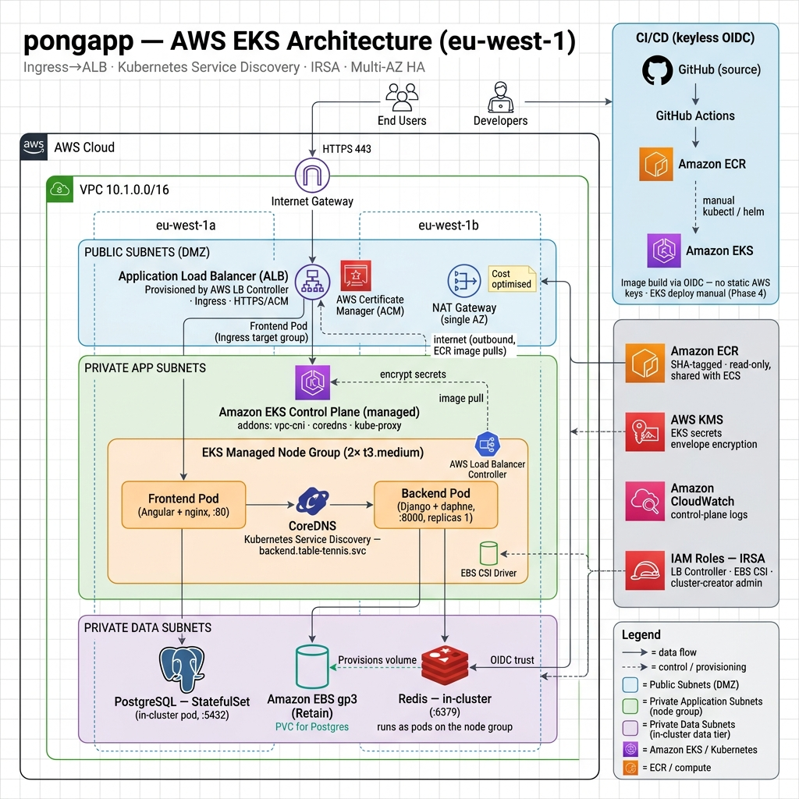
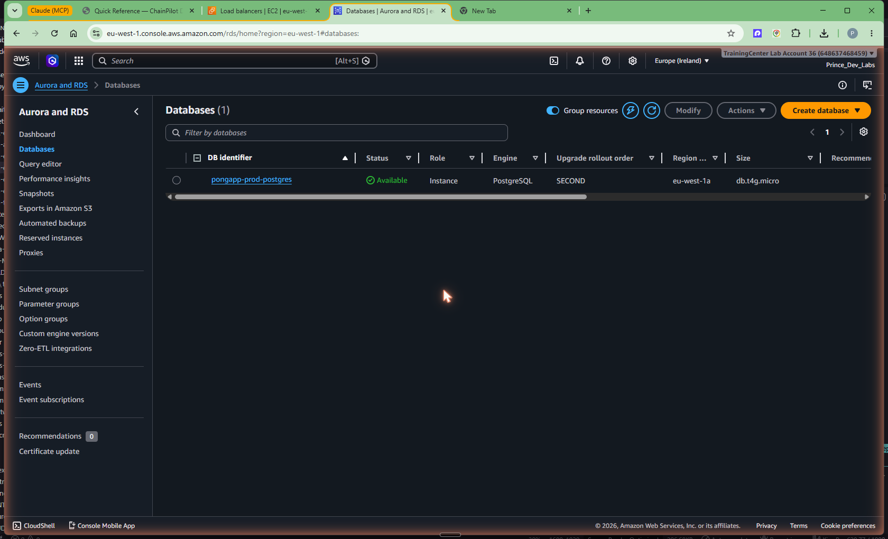
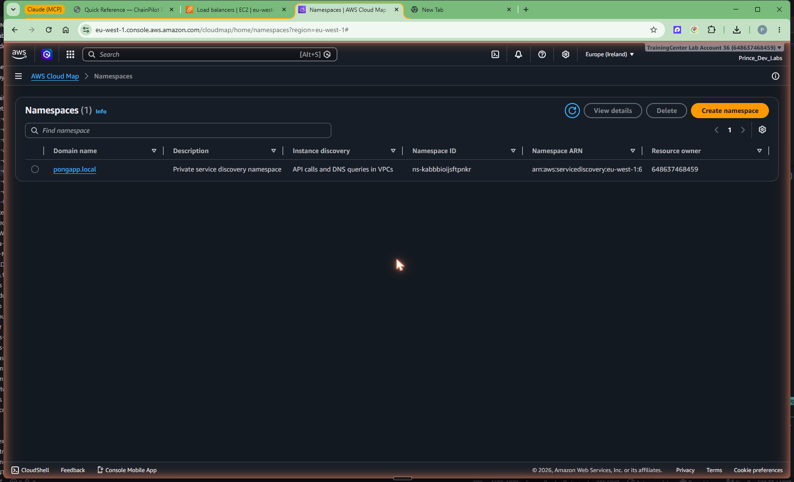

# pongapp: Amazon ECS Fargate vs Amazon EKS — A DevOps Orchestration Benchmark

A production-style benchmark that deploys one real four-tier web application to **both Amazon ECS (Fargate) and Amazon EKS** on AWS, provisioned entirely with Terraform, in order to produce an evidence-based recommendation on which container orchestrator best fits the organisation. The project implements service discovery, load balancing, a blue/green CI/CD pipeline, and automated failure recovery on each platform, and documents every phase with reproducible steps and captured evidence.

The application under test is a table-tennis league app: an Angular single-page front end served by nginx, a Django REST and WebSocket backend on daphne, PostgreSQL for persistence, and Redis for caching and channels. The same container images run unchanged on both platforms, so the comparison isolates the orchestrator rather than the application.

---

## Table of Contents

- [Motivation](#motivation)
- [Architecture](#architecture)
- [Build Walkthrough and Evidence](#build-walkthrough-and-evidence)
- [Benchmark Results](#benchmark-results)
- [Prerequisites](#prerequisites)
- [Installation and Setup](#installation-and-setup)
- [Usage](#usage)
- [Project Structure](#project-structure)
- [Key Technologies](#key-technologies)
- [Learning Outcomes](#learning-outcomes)
- [Challenges and Solutions](#challenges-and-solutions)
- [Future Improvements](#future-improvements)
- [Contributing](#contributing)
- [License](#license)
- [Author](#author)

---

## Motivation

Most "Kubernetes versus ECS" comparisons are written from documentation rather than from a build. The goal of this project was to remove that gap by shipping the **same application** to both platforms under identical constraints — same container images, same region (`eu-west-1`), same networking model, same definition of done — so that the recommendation rests on observed cost, effort, and behaviour rather than opinion.

The work was structured as a six-phase benchmark, each phase ending with verified evidence and a written chapter:

1. Containerise the application and verify it locally with Docker Compose.
2. Provision shared AWS infrastructure with Terraform (VPC, ECR, IAM/OIDC, data services).
3. Deploy to ECS Fargate with AWS Cloud Map service discovery and a blue/green pipeline.
4. Deploy to Amazon EKS with the AWS Load Balancer Controller and the EBS CSI driver.
5. Demonstrate automatic recovery by killing live containers and pods on both platforms.
6. Score the two platforms and publish a recommendation with trade-offs.

The intent was to practise infrastructure-as-code discipline, AWS networking, two distinct orchestration models, and the operational reality of running a stateful application in the cloud, and to make the trade-offs defensible.

---

## Architecture

Both deployments share the same topology: a private VPC with public subnets for the load balancer and NAT egress, private application subnets for compute, and private data subnets, spread across two Availability Zones. Internet traffic always terminates at an Application Load Balancer; internal traffic resolves through a service-discovery mechanism native to each platform. The diagrams below are deliberately symmetric so the differences stand out.

### ECS Fargate


A public ALB performs blue/green routing across two target groups to the Angular/nginx **frontend** task, which proxies `/api` and `/ws` to the Django **backend** task. The frontend discovers the backend through **AWS Cloud Map** (`backend.pongapp.local`). State is fully managed: **Amazon RDS for PostgreSQL** and **Amazon ElastiCache for Redis**. Secrets live in **AWS Secrets Manager**, and images are delivered by GitHub Actions through keyless OIDC to Amazon ECR.

### Amazon EKS



The EKS deployment reuses the same images and the Kubernetes manifests under `k8s/`. The edge ALB is created automatically by the **AWS Load Balancer Controller** from a Kubernetes `Ingress`. Internal discovery uses native cluster DNS through CoreDNS (`backend.table-tennis.svc`). Persistence is self-hosted: a PostgreSQL `StatefulSet` backed by an Amazon EBS volume through the **EBS CSI driver**, plus an in-cluster Redis. Pod-level AWS permissions are granted with **IRSA** (IAM Roles for Service Accounts), and cluster secrets are encrypted with a dedicated KMS key. The EKS root runs in its own VPC (`10.1.0.0/16`) to keep the two benchmarks isolated.

The most consequential differences the diagrams make visible: managed data services (ECS) versus self-hosted stateful workloads (EKS); Cloud Map versus CoreDNS for discovery; and a control plane that AWS fully manages and bills (EKS) versus no control-plane charge at all (ECS). An interactive walkthrough of the EKS Terraform module graph, the exact command sequence, and the failures encountered is published in [`docs/eks-explorer.html`](docs/eks-explorer.html).

---

## Build Walkthrough and Evidence

Each phase below links to its full chapter and shows representative captured evidence. Complete galleries live in [`docs/`](docs/) and [`benchmark/docs/`](benchmark/docs/).

### Phase 2 — Shared infrastructure (Terraform)

Managed data services and the private service-discovery namespace, provisioned as code.





Full chapter: [`docs/02-terraform-infrastructure.md`](docs/02-terraform-infrastructure.md).

### Phase 3 — ECS Fargate deployment and CI/CD

Two Fargate services behind a blue/green ALB, deployed by a GitHub Actions pipeline.


Full chapter: [`docs/03-ecs-deploy-and-cicd.md`](docs/03-ecs-deploy-and-cicd.md).

### Phase 4 — Amazon EKS deployment

A managed cluster, a healthy node group, and the application served through a controller-provisioned ALB.


Full chapter: [`docs/04-eks-deploy.md`](docs/04-eks-deploy.md).

### Phase 5 — Resiliency (automatic recovery)

Both platforms self-heal. On EKS, killing the PostgreSQL StatefulSet pod reattached the same EBS volume and the data survived.


Full chapter: [`docs/05-resiliency.md`](docs/05-resiliency.md).

---

## Benchmark Results

The full scored matrix and reasoning are in [`benchmark/docs/benchmark-report.md`](benchmark/docs/benchmark-report.md). Summary:

| Dimension | ECS Fargate | Amazon EKS |
|-----------|:----------:|:----------:|
| Cost (idle orchestration floor) | approx. $53/month | approx. $194/month |
| Operational overhead | Lower (no nodes, no control-plane fee) | Higher (node patching, addons, control-plane fee) |
| Developer experience | AWS-native task definitions | Standard Kubernetes manifests, strong local parity |
| Service discovery and load balancing | Cloud Map plus ALB | CoreDNS plus controller-provisioned ALB |
| Scalability | Service auto-scaling | HPA, Cluster Autoscaler, Karpenter |
| Resiliency | Zero-downtime blue/green | Self-healing, near-zero-downtime |
| Ecosystem and portability | AWS-specific | Portable Kubernetes |
| Security | Task roles plus Secrets Manager | IRSA plus KMS plus PodSecurity |
| Weighted total (single-app team) | 4.3 / 5 | 3.6 / 5 |

**Recommendation:** for a single application maintained by a small, AWS-committed team, **ECS Fargate** is the better fit — lower cost, materially less operational overhead, and the shortest path to production. **Amazon EKS** becomes the stronger choice when multi-cloud portability, fleet scale, or existing Kubernetes expertise are priorities. A rehearsable demo running order is provided in [`benchmark/docs/walkthrough-script.md`](benchmark/docs/walkthrough-script.md).

---

## Prerequisites

- AWS account with permissions to create VPC, EKS, ECS, RDS, ElastiCache, IAM, and KMS resources
- Terraform 1.10 or newer (native S3 state locking)
- AWS CLI v2, configured with `aws configure`
- Docker 24+ and Docker Compose (local verification)
- kubectl 1.30+ (EKS track)
- Helm 3.x or newer (EKS track; the AWS Load Balancer Controller is Helm-installed)
- An S3 bucket for Terraform remote state, referenced in each environment root's `backend.tf`

---

## Installation and Setup

The repository contains two independent Terraform roots so the platforms can be stood up separately. Run only the track you need; both bill while running.

### Local verification

```bash
cp .env.example .env          # populate values
docker compose up --build
# Frontend: http://localhost
# Backend health: http://localhost:8080/api/health/
```

### ECS Fargate track

```bash
cd infra/terraform/envs/prod-ecs
terraform init
terraform apply                # VPC, ECR, RDS, ElastiCache, Cloud Map, ALB, ECS
```

Images are then built and pushed by the GitHub Actions workflows (`ci.yml`, `deploy.yml`) using the OIDC role created by Terraform; the deploy workflow performs the blue/green rollout.

### Amazon EKS track

```bash
cd infra/terraform/envs/prod-eks
terraform init
terraform apply                # VPC, EKS control plane, node group, IRSA, EBS CSI

# Point kubectl at the new cluster
aws eks update-kubeconfig --name pongapp-prod --region eu-west-1
kubectl get nodes              # expect two nodes Ready

# Install the AWS Load Balancer Controller, bound to its IRSA role
ROLE_ARN=$(terraform output -raw aws_lb_controller_role_arn)
helm repo add eks https://aws.github.io/eks-charts && helm repo update
helm install aws-load-balancer-controller eks/aws-load-balancer-controller -n kube-system \
  --set clusterName=pongapp-prod \
  --set serviceAccount.name=aws-load-balancer-controller \
  --set-string serviceAccount.annotations."eks\.amazonaws\.com/role-arn"=$ROLE_ARN \
  --set region=eu-west-1 --set vpcId=$(terraform output -raw vpc_id)

# Apply secrets (gitignored) and the EKS overlay
kubectl apply -f k8s/secrets/db-credentials.yaml -f k8s/secrets/app-secrets.yaml
kubectl kustomize --load-restrictor LoadRestrictionsNone benchmark/eks | kubectl apply -f -
```

### Teardown

Cloud resources bill hourly. Always destroy what you are not actively demonstrating.

```bash
# EKS: remove the Ingress first so the controller deletes the ALB, then:
helm uninstall aws-load-balancer-controller -n kube-system
terraform -chdir=infra/terraform/envs/prod-eks destroy
# The Postgres EBS volume uses a Retain policy; delete it manually afterwards.

terraform -chdir=infra/terraform/envs/prod-ecs destroy
```

---

## Usage

```bash
# EKS cluster and workload status
kubectl get nodes
kubectl get pods,ingress -n table-tennis

# Verify the application through the load balancer
curl -s -o /dev/null -w "%{http_code}\n" "http://<alb-hostname>/"
curl -s -o /dev/null -w "%{http_code}\n" "http://<alb-hostname>/api/health/"

# Demonstrate self-healing (EKS)
kubectl delete pod <frontend-pod> -n table-tennis      # ReplicaSet recreates it
kubectl delete pod postgres-0 -n table-tennis          # StatefulSet reattaches the EBS volume

# Demonstrate self-healing (ECS)
aws ecs stop-task --cluster pongapp-prod-cluster --task <task-id>
```

---

## Project Structure

```
tabltennis-kube/
├── apps/
│   ├── frontend/                 # Angular app, multi-stage Docker build, nginx
│   └── backend/                  # Django + daphne API
├── infra/terraform/
│   ├── modules/                  # Reusable modules
│   │   ├── network/              # VPC, subnets, NAT, security groups
│   │   ├── ecr/ · iam-github-oidc/
│   │   ├── ecs-cluster/ · ecs-service/ · cloudmap/ · alb/ · rds/ · elasticache/
│   │   └── eks-cluster/          # EKS control plane, node group, addons
│   └── envs/
│       ├── prod-ecs/             # ECS root (owns ECR + OIDC singletons)
│       └── prod-eks/             # EKS root (own VPC, reads ECR read-only)
├── k8s/                          # Base Kubernetes manifests (local + EKS source of truth)
├── benchmark/
│   ├── eks/                      # Kustomize overlay adapting k8s/ for EKS
│   └── docs/                     # Benchmark report and walkthrough script
├── deploy/ecs/                   # ECS task definitions and blue/green config
├── .github/workflows/            # ci.yml (build to ECR), deploy.yml (blue/green)
├── docs/                         # Tutorial chapters, architecture diagrams, assets, explorers
└── README.md
```

The `benchmark/eks/` overlay never copies the base manifests; it references `k8s/` and layers EKS-specific changes (EBS StorageClasses, an ALB Ingress, and targeted patches) on top, keeping a single source of truth.

---

## Key Technologies

- **Amazon ECS on Fargate** — serverless container orchestration with no nodes to manage; chosen to represent the lowest-operational-overhead AWS-native option.
- **Amazon EKS** — managed Kubernetes; chosen to represent the portable, ecosystem-rich option and to measure its operational cost honestly.
- **Terraform** — all infrastructure is declarative, split into reusable modules and two environment roots with remote S3 state and native lockfile locking.
- **AWS Cloud Map and Kubernetes DNS** — the two service-discovery models compared internally.
- **AWS Load Balancer Controller** — translates a Kubernetes `Ingress` into a managed ALB, mirroring the ECS ALB edge.
- **Amazon EBS CSI driver with IRSA** — dynamic block storage for the stateful tier without node-level credentials.
- **GitHub Actions with OIDC** — keyless CI/CD; no static AWS keys are stored in the repository.
- **Docker (multi-stage)** — identical images run locally, on ECS, and on EKS.

---

## Learning Outcomes

- Built and operated the same application on two orchestration models and articulated the trade-offs with measured cost and recovery data.
- Authored modular Terraform and managed two independent environment roots sharing common modules, including safe handling of account-global singletons (the GitHub OIDC provider and shared ECR repositories).
- Implemented IRSA, KMS secret encryption, security-group segmentation, and PodSecurity standards.
- Configured the AWS Load Balancer Controller, the EBS CSI driver, and EKS managed addons, and learned the ordering constraints between them.
- Demonstrated and measured automatic recovery, including stateful recovery with volume reattachment and verified data survival.
- Produced reproducible, evidence-backed documentation for each phase.

---

## Challenges and Solutions

### EKS node group failed to join the cluster

**Problem:** The first `terraform apply` failed after roughly twenty minutes with `NodeCreationFailure: Unhealthy nodes`, and the nodes reported `cni plugin not initialized`.

**Root cause:** The `vpc-cni` addon was scheduled to install after the managed node group. Nodes therefore booted with no container network interface, never became `Ready`, and the node group timed out before Terraform reached the addon — a dependency deadlock.

**Solution:** Set `before_compute = true` on the `vpc-cni` and `kube-proxy` addons so the network plugin is present before nodes join, then recreated the failed node group with `terraform apply -replace`. Nodes then joined `Ready` and the remaining addons reconciled.

### Frontend rejected by PodSecurity, then crash-looping

**Problem:** Frontend pods were refused with a PodSecurity `restricted` violation; once admitted they crash-looped with `host not found in resolver "__CLUSTER_DNS__"`.

**Root cause:** The namespace enforced the `restricted` PodSecurity standard, which the official nginx image (root, port 80) does not satisfy; separately, the nginx configuration template received an unsubstituted DNS-resolver placeholder.

**Solution:** Relaxed enforcement to `baseline` through a namespace patch (matching the ECS deployment, which has no PodSecurity layer) and set the resolver to the live CoreDNS cluster IP at deploy time.

### Backend target unhealthy behind the ALB

**Problem:** The backend target group remained unhealthy even though the pod was running.

**Root cause:** The Ingress applied a single global health-check path of `/`, which the Django backend answers with 404 because only `/api` and `/admin` exist.

**Solution:** Added a per-Service health-check annotation pointing the backend target group at `/api/health/`; the AWS Load Balancer Controller honours health-check annotations per target group.

### Maintaining ECS and EKS parity in one repository

**Problem:** An early refactor replaced the ECS Terraform with EKS in a single environment root, which would have silently dismantled the ECS side of the benchmark.

**Solution:** Split the configuration into two roots (`prod-ecs`, `prod-eks`) sharing common modules, kept the ECR repositories and GitHub OIDC provider in a single owning root, and added a `prevent_destroy` guard on the shared repositories so neither track can delete the published images.

---

## Future Improvements

- Move backend media and static assets to Amazon S3 or Amazon EFS so the backend can run multiple replicas on EKS and achieve true zero-downtime recovery (the current ReadWriteOnce EBS volume forces a single replica).
- Add observability with Amazon CloudWatch Container Insights, or Prometheus and Grafana, to compare monitoring effort across platforms.
- Introduce a GitOps workflow (Argo CD or Flux) for the EKS track to mirror the ECS pipeline.
- Add Cluster Autoscaler or Karpenter and load-test the autoscaling behaviour of each platform.
- Parameterise the data tier so EKS can optionally consume the same managed RDS and ElastiCache as ECS for a like-for-like persistence comparison.

---

## Contributing

Contributions and suggestions are welcome.

1. Fork the repository.
2. Create a feature branch.
3. Commit your changes with clear messages.
4. Open a pull request describing the change and its rationale.

For substantial changes, please open an issue to discuss the approach first.

---

## License

This project is released under the MIT License.

---

## Author

**Prince Ayiku** — DevOps and Cloud Engineering

- GitHub: [@celetrialprince166](https://github.com/celetrialprince166)
- Email: prince.ayiku@amalitechtraining.org
