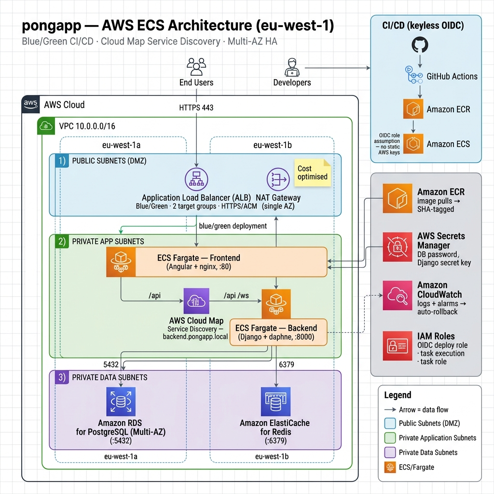

# pongapp — ECS ⇄ EKS Benchmark

A real 4-tier application (Angular + Django + Postgres + Redis) used to benchmark
**AWS ECS Fargate** against **Amazon EKS**: the same app is shipped to both, with
service discovery, load balancing, blue/green CI/CD, and an auto-recovery demo, so
we can recommend which orchestrator fits the company. Every phase is documented
end-to-end with screenshots and a tutorial chapter.

> "ShopNow" in the original brief is a placeholder — this app is the subject.

## Architecture (ECS)



Public ALB (blue/green) → **frontend** (Angular/nginx) → **backend** (Django/daphne)
via **AWS Cloud Map** service discovery → **RDS** (Postgres) + **ElastiCache** (Redis).
CI/CD is GitHub Actions → ECR → ECS using **keyless OIDC**.

## Repo layout

| Path | What |
|------|------|
| `apps/frontend/` | Angular app, served by nginx (port 80) |
| `apps/backend/` | Django API on daphne (port 8000) |
| `infra/terraform/` | VPC, ECR, ALB, Cloud Map, RDS, ElastiCache, IAM (OIDC) |
| `deploy/ecs/` | ECS task definitions / blue-green config |
| `.github/workflows/` | `ci.yml` (build → ECR) · `deploy.yml` (blue/green) |
| `k8s/` | Kubernetes manifests (reused for the EKS phase) |
| `docs/` | Tutorials, architecture diagrams, benchmark report |
| `AGENTS.md` · `.claude/` | The agent + skills framework that drives the build |

## Run locally

```bash
cp .env.example .env   # then fill in values
docker compose up --build
```

- Frontend: http://localhost
- Backend API: http://localhost:8080/api/health/

## Roadmap

See **AGENTS.md §3**. Current focus: the **ECS track** (containerize → Terraform →
ECS Fargate blue/green). EKS, resiliency, and the benchmark report follow.

## Teardown

Cloud resources bill hourly. Always `terraform destroy` in `infra/terraform/envs/prod`
when not actively demoing.
