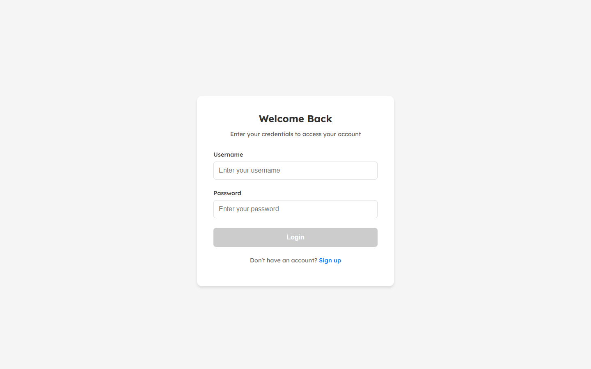
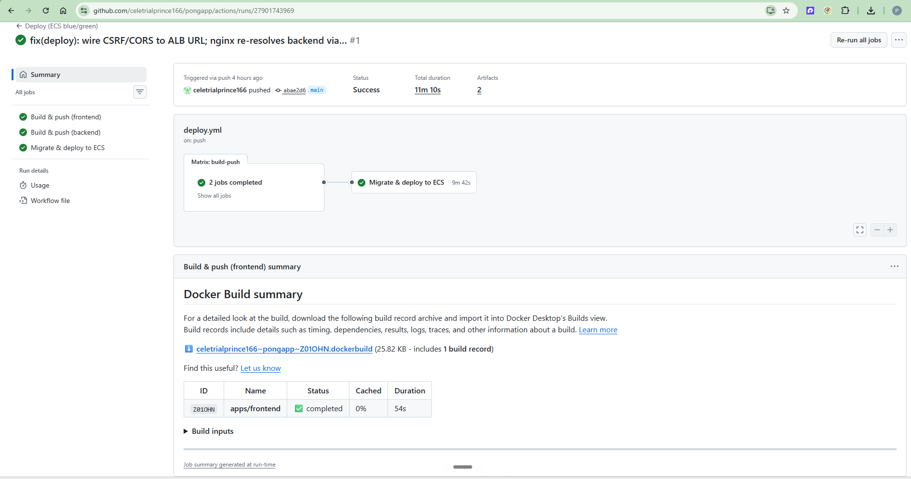
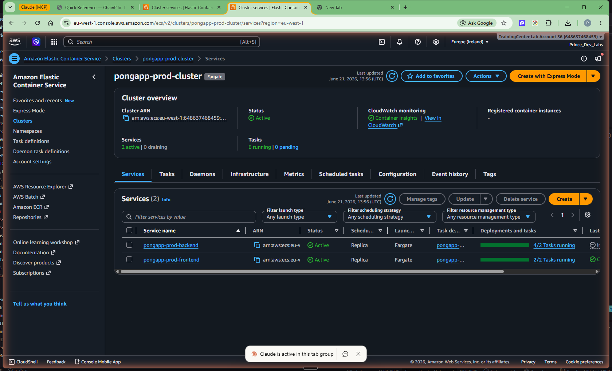
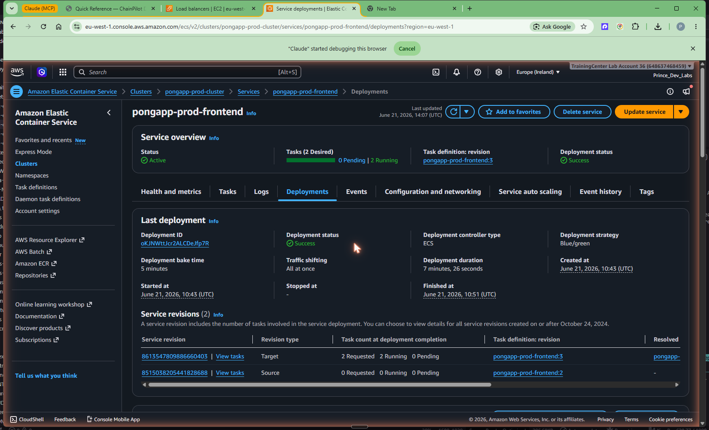
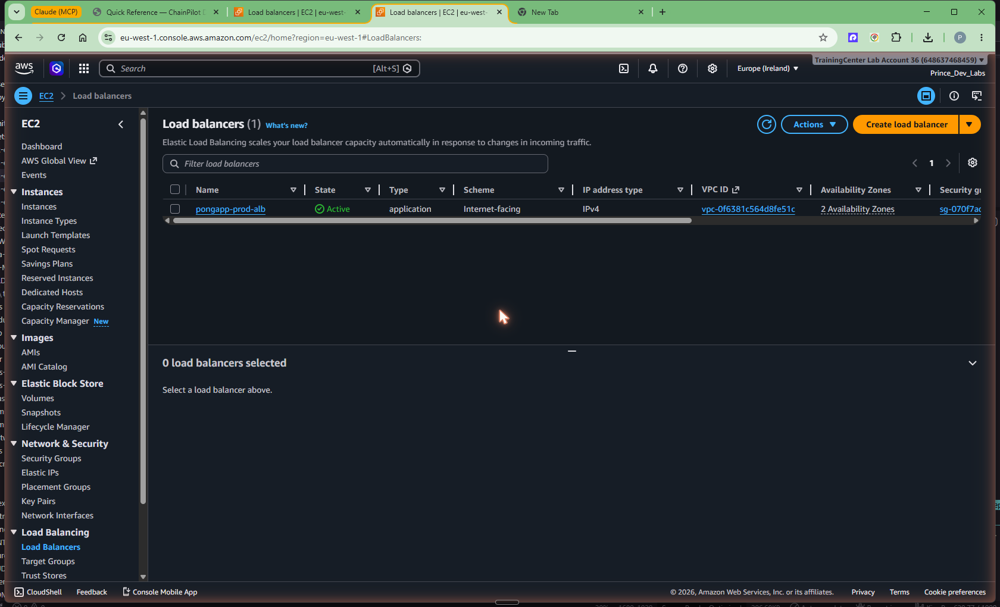
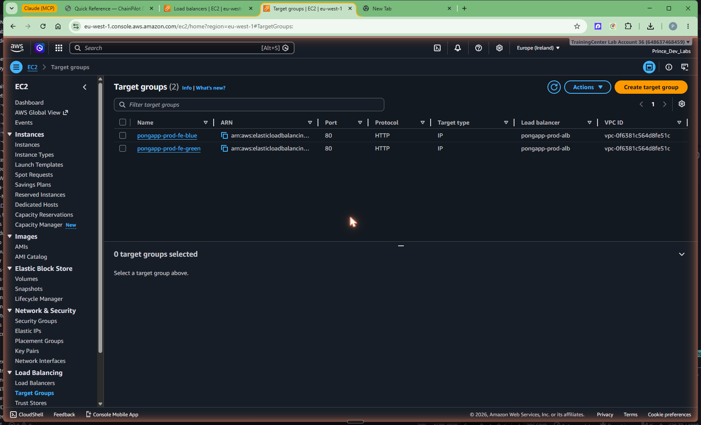

# Phase 3 — ECS Deploy + CI/CD (and the bugs we hit)

## Goal

Take the infrastructure from Phase 2 and actually ship the app to it: a GitHub
Actions pipeline that builds both images, pushes them to ECR over keyless OIDC,
runs database migrations safely, and deploys to ECS Fargate — the **frontend via
ECS-native blue/green**, the **backend rolling**, behind a public ALB with Cloud
Map service discovery between them. The end state is the app live on the internet
with a green pipeline.

It is live right now:

**http://pongapp-prod-alb-734452423.eu-west-1.elb.amazonaws.com**



The root path serves the Angular SPA from the nginx frontend tasks; `/api/health/`
is proxied through nginx to the Django backend and returns `{"status":"healthy"}`:


> The most valuable part of this chapter is the **Troubleshooting** section — two
> real bugs that took the first bring-up from crash-looping to green. Don't skip
> it.

## Prerequisites

- **Phase 2 applied:** VPC, ECR, ALB (blue/green target groups), Cloud Map,
  RDS, ElastiCache, the Fargate cluster, both ECS services, and the two OIDC IAM
  roles all exist.
- **The two OIDC role ARNs** from `terraform output`:
  - CI role: `arn:aws:iam::648637468459:role/pongapp-prod-gha-ci`
  - Deploy role: `arn:aws:iam::648637468459:role/pongapp-prod-gha-deploy`
- **GitHub repo** on the `main` branch, with Actions enabled.

## Concepts (the "why")

**Two pipelines, two privilege levels.** PRs run `ci.yml` — Angular production
build + backend `flake8` — with **no AWS access at all**. Only a push to `main`
runs `deploy.yml`, which touches AWS. Separating them means untrusted PR code can
never assume an AWS role, and the expensive build-and-deploy only happens on
merged, trusted code.

**Two roles inside the deploy too.** `deploy.yml` first assumes the narrow **CI
role** to build and push images to ECR, then assumes the **deploy role** to
register task definitions, run tasks, and update services. Each job gets only the
permissions it needs. Both via OIDC — no stored keys (see Phase 2).

**A one-shot `migrate` step before rolling tasks.** If you let every starting
backend task run `manage.py migrate`, then during a rollout (multiple new tasks
booting at once, plus blue/green doubling them) you get *concurrent* migrations
racing on the same database — a classic way to corrupt schema state. So the
backend entrypoint gained a dedicated mode: `docker-entrypoint.sh migrate` runs
migrations once and exits 0. The pipeline runs exactly one such task and waits for
a clean exit *before* rolling any serving tasks. Normal task starts skip
migrations in this flow.

**Frontend blue/green, backend rolling.** The frontend is the public edge, so it
gets ECS-native blue/green: a green task set comes up on a second target group,
bakes, then the listener rule flips traffic — instant rollback if it's unhealthy,
zero dropped requests. The backend sits behind Cloud Map (DNS), where a simpler
rolling update is enough and avoids the cost of a second pair of target groups for
an internal service. Different exposure, different deploy strategy.

**Smoke test on the ALB at the end.** The pipeline only declares success after it
curls the *public* ALB for both `/api/health/` (200) and `/` (200). If the rollout
looked healthy but the edge is broken, the pipeline fails — which is what you want.

## The pipeline files

- `.github/workflows/ci.yml` — PR checks (Angular build, backend flake8). No AWS.
- `.github/workflows/deploy.yml` — push to `main`: build+push both images, then
  run `deploy/ecs/deploy.sh`.
- `deploy/ecs/deploy.sh` — the deploy logic (migrate → roll backend →
  blue/green frontend → wait → smoke test).
- `apps/backend/docker-entrypoint.sh` — added the `migrate` one-shot mode.
- `apps/frontend/nginx/default.conf.template` — the runtime DNS re-resolution fix.

## Steps

The pipeline is fully automated; "running it" is pushing to `main`. Here's what
each stage does and how to read it.

### 1. PR checks (`ci.yml`)

On every PR to `main`:

```yaml
# Frontend: production Angular build
- run: npm ci
- run: npx ng build --configuration production
# Backend: lint, fail only on real errors
- run: flake8 backend/ --count --select=E9,F63,F7,F82 --show-source --statistics
```

Compiles the frontend and catches Python syntax errors / undefined names — fast
feedback, zero cloud cost.

### 2. Build & push both images (`deploy.yml`, CI role)

On push to `main`, a matrix job builds `frontend` and `backend` and pushes them to
ECR, tagged with the **git SHA** (and `latest`):

```yaml
- uses: aws-actions/configure-aws-credentials@v4
  with:
    role-to-assume: ${{ env.CI_ROLE_ARN }}   # OIDC, no static keys
- uses: aws-actions/amazon-ecr-login@v2
- uses: docker/build-push-action@v6
  with:
    context: apps/${{ matrix.service }}
    push: true
    tags: |
      ${{ env.ECR_REGISTRY }}/pongapp-${{ matrix.service }}:${{ github.sha }}
      ${{ env.ECR_REGISTRY }}/pongapp-${{ matrix.service }}:latest
```

The SHA tag is what the deploy step pins task definitions to — never a moving
`:latest` in the running task def.

### 3. Migrate + deploy (`deploy.yml`, deploy role → `deploy.sh`)

```yaml
- uses: aws-actions/configure-aws-credentials@v4
  with:
    role-to-assume: ${{ env.DEPLOY_ROLE_ARN }}
- name: Migrate + blue/green deploy
  run: bash deploy/ecs/deploy.sh
  env:
    AWS_REGION: ${{ env.AWS_REGION }}
    ACCOUNT_ID: ${{ env.ACCOUNT_ID }}
    IMAGE_TAG: ${{ github.sha }}
```

`deploy/ecs/deploy.sh` does six things, in order:

1. **Register a new backend task-def revision** with the new image (clones the
   latest revision, swaps the `backend` container image via `jq`).
2. **Run one-shot migrations:** `run-task` with
   `containerOverrides … command:["migrate"]`, reusing the backend service's own
   network config; `wait tasks-stopped`; **abort the deploy if exit code != 0**
   (and print `stoppedReason`).
3. **Roll the backend service** to the new task def (rolling update).
4. **Register a new frontend task-def revision** and update the frontend service —
   ECS-native blue/green shifts traffic automatically after the bake.
5. **`wait services-stable`** on both services (the blue/green bake is included).
6. **Smoke-test the ALB:** `curl` `/api/health/` and `/` and fail if either isn't
   200.

```bash
# Step 2 — the safe, one-shot migration (excerpt from deploy.sh)
TASK_ARN=$(aws ecs run-task --cluster "$CLUSTER" --task-definition "$BE_TD" \
  --launch-type FARGATE --network-configuration "$NETCFG" \
  --overrides '{"containerOverrides":[{"name":"backend","command":["migrate"]}]}' \
  --query 'tasks[0].taskArn' --output text)
aws ecs wait tasks-stopped --cluster "$CLUSTER" --tasks "$TASK_ARN"
# ... abort if exitCode != 0 ...
```

A green pipeline run end-to-end — both image builds plus the migrate-and-deploy
job, pushed to `main`, completing in ~11 minutes with keyless OIDC:



## Verification

After a green run, the app answers on the public ALB. Verified live (real output):

```console
$ curl -s -o /dev/null -w "root HTTP %{http_code}\n" \
    http://pongapp-prod-alb-734452423.eu-west-1.elb.amazonaws.com/
root HTTP 200

$ curl -s http://pongapp-prod-alb-734452423.eu-west-1.elb.amazonaws.com/api/health/
{"status": "healthy"}
```

Two things this proves at once:
- `/` 200 → the **frontend** nginx tasks are serving the Angular build through the
  ALB (screenshot `p3-ecs-live-app-01.png`).
- `/api/health/` 200 → the request went **frontend nginx → Cloud Map
  (`backend.pongapp.local`) → backend Django** and back. The whole east-west path
  works (screenshot `p3-ecs-api-health-02.png`).

Control-plane / networking spot checks (console-free):

```bash
aws ecs describe-services --cluster pongapp-prod-cluster \
  --services pongapp-prod-frontend pongapp-prod-backend \
  --query 'services[].{name:serviceName,running:runningCount,desired:desiredCount}'

aws elbv2 describe-target-health --target-group-arn <blue_tg_arn> \
  --query 'TargetHealthDescriptions[].TargetHealth.State'   # healthy
```

### Console evidence

The ECS cluster — both services Active, 4 tasks running on Fargate:



The frontend service's **Deployments** tab — note **Deployment controller type: ECS**,
**Deployment strategy: Blue/green**, 5-minute bake, and the service revisions resolved
against the `pongapp-prod-fe-green` target group + the production listener rule:



The public Application Load Balancer (internet-facing, 2 AZs):



The two target groups that make blue/green possible — `pongapp-prod-fe-blue` and
`pongapp-prod-fe-green`, both IP-type, attached to the ALB:



## Troubleshooting

These are the two real failures from first bring-up. Both are the kind of thing
that only shows up once you leave `docker-compose` for a real cloud network — which
makes them the best teaching material in the whole phase.

### Bug 1 — Backend crash-loop: Django rejects `*` for CSRF/CORS origins

**Symptom.** Backend tasks started, then immediately died and were replaced, over
and over. The logs showed Django **system check errors E001 / E013**: a wildcard
`*` is not an acceptable value for `CSRF_TRUSTED_ORIGINS` /
`CORS_ALLOWED_ORIGINS`. Those settings demand full, scheme-qualified origins
(`http://host`), not the `*` you can sometimes get away with for
`ALLOWED_HOSTS`. With the check failing, the process never finished booting →
crash-loop.

**Fix.** Wire both settings to the real ALB origin. In the backend task
environment (`envs/prod/main.tf`):

```hcl
environment = {
  DJANGO_ALLOWED_HOSTS        = "*"
  DJANGO_CSRF_TRUSTED_ORIGINS = "http://${module.alb.alb_dns_name}"
  CORS_ALLOWED_ORIGINS        = "http://${module.alb.alb_dns_name}"
  # ...
}
```

`ALLOWED_HOSTS` may stay `*`; the *origin* allowlists must be concrete URLs.
Deriving them from `module.alb.alb_dns_name` keeps them correct automatically.

### Bug 2 — Frontend 502s: nginx cached a dead backend IP

**Symptom.** The frontend served the SPA fine (`/` was 200), but every `/api/...`
call returned **502 Bad Gateway**. The backend was healthy. The culprit: nginx
resolves a hostname in a static `proxy_pass http://backend.pongapp.local:8000;`
**once, at startup**, and caches that IP forever. When the backend task was
replaced (new task = new IP, normal in Fargate/Cloud Map), nginx kept proxying to
the now-dead IP.

**Fix — make nginx re-resolve per request.** In
`apps/frontend/nginx/default.conf.template`:

```nginx
# Re-resolve the backend at runtime instead of caching one IP at startup.
resolver ${BACKEND_RESOLVER} valid=10s ipv6=off;   # 169.254.169.253 = Amazon VPC DNS
set $backend_upstream ${BACKEND_HOST}:${BACKEND_PORT};

location /api/ {
    proxy_pass http://$backend_upstream;           # variable upstream → re-resolved
    # ...
}
```

Two things make this work: pointing `resolver` at the Amazon-provided VPC DNS
(`169.254.169.253`) with a short `valid=10s` TTL, and using a **variable**
(`$backend_upstream`) in `proxy_pass`. nginx only does runtime DNS resolution when
the upstream is a variable; a literal name is resolved once at config load. The
resolver address is injected as `BACKEND_RESOLVER` so the same image works on
docker-compose (Docker DNS `127.0.0.11`) and ECS (VPC DNS). Bonus: this is exactly
what makes the Phase 5 resiliency demo work — kill a backend task and nginx picks
up the replacement within ~10s instead of 502ing.

**Plus a Terraform fix.** While debugging this we hit the Cloud Map perpetual-
replace problem (an empty `health_check_custom_config {}` block the provider can't
read back). Without it, applies that touched the service tried to *replace* it,
which fails while tasks are registered. Fix in `modules/ecs-service/main.tf`:

```hcl
lifecycle {
  ignore_changes = [health_check_custom_config]
}
```

### Outcome

After both fixes the pipeline ran **green end-to-end**, the app went live, and
`/api/health/` returns 200 both ways — hit directly and through the nginx proxy.

## Cost & teardown

Same running cost as Phase 2 — roughly **$2.50–$3.00/day** (NAT + ALB + RDS +
ElastiCache + Fargate). The deploy itself adds only transient cost (a short
migration task; brief doubled frontend tasks during the blue/green bake).

Tear everything down:

```bash
cd infra/terraform/envs/prod
terraform destroy
```

That removes the ECS services, ALB, data stores, NAT, and IAM roles. ECR images
and the remote-state bucket persist unless you delete them explicitly.

## Key takeaways

- **Split CI (no AWS) from deploy (AWS via OIDC)** so untrusted PR code can never
  assume a cloud role.
- **Migrate once, out of band.** A one-shot `migrate` task before rolling avoids
  concurrent migrations racing across blue/green tasks.
- **Match deploy strategy to exposure:** blue/green for the public frontend,
  rolling for the internal backend.
- **`*` is fine for `ALLOWED_HOSTS`, never for CSRF/CORS origins** — those need
  concrete `http(s)://host` values or Django refuses to boot (E001/E013).
- **With DNS service discovery, nginx must re-resolve per request** (resolver +
  short TTL + variable `proxy_pass`) or it caches a dead IP and 502s.
- **End the pipeline with a public smoke test** so "deployed" really means
  "reachable."
