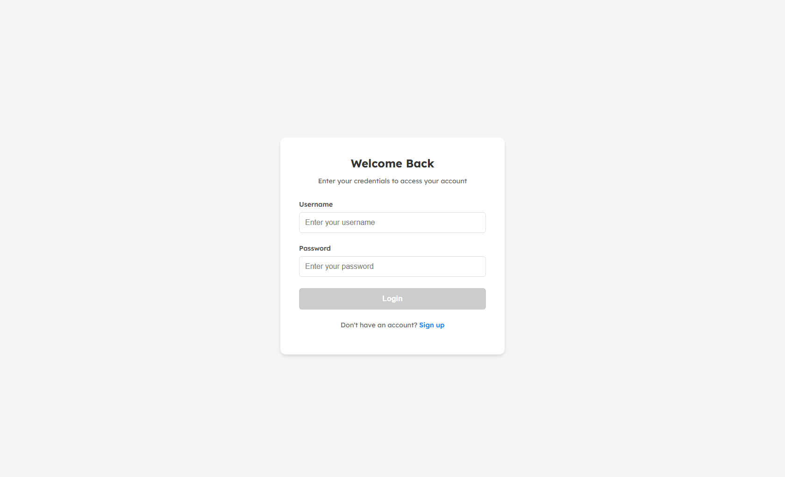
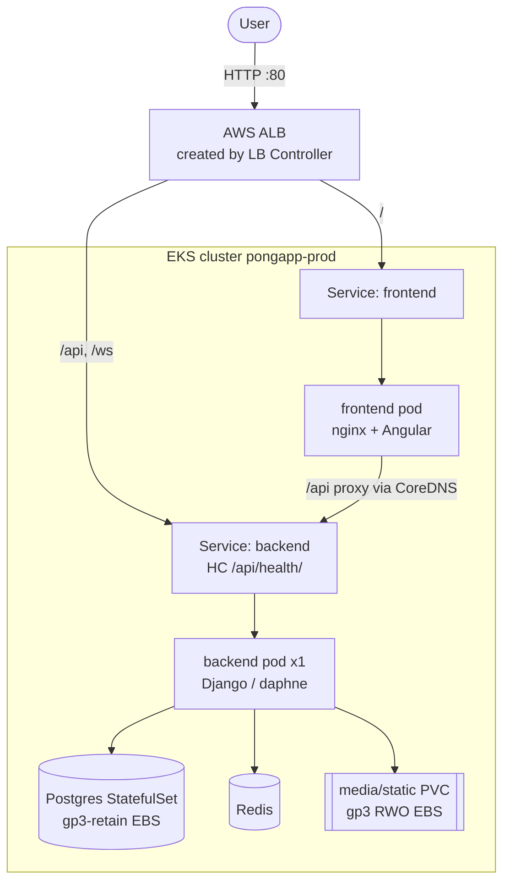
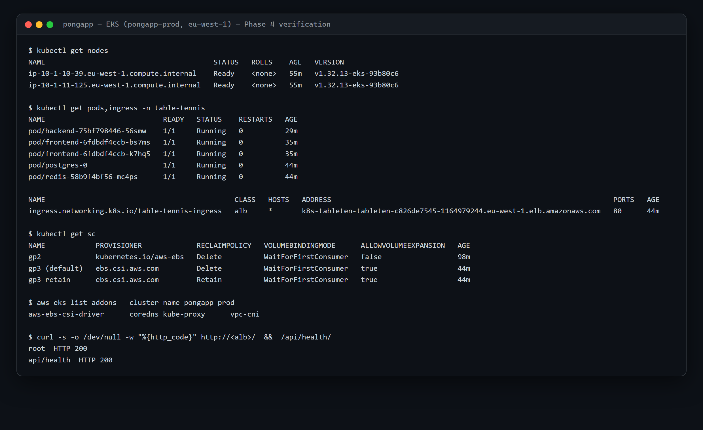
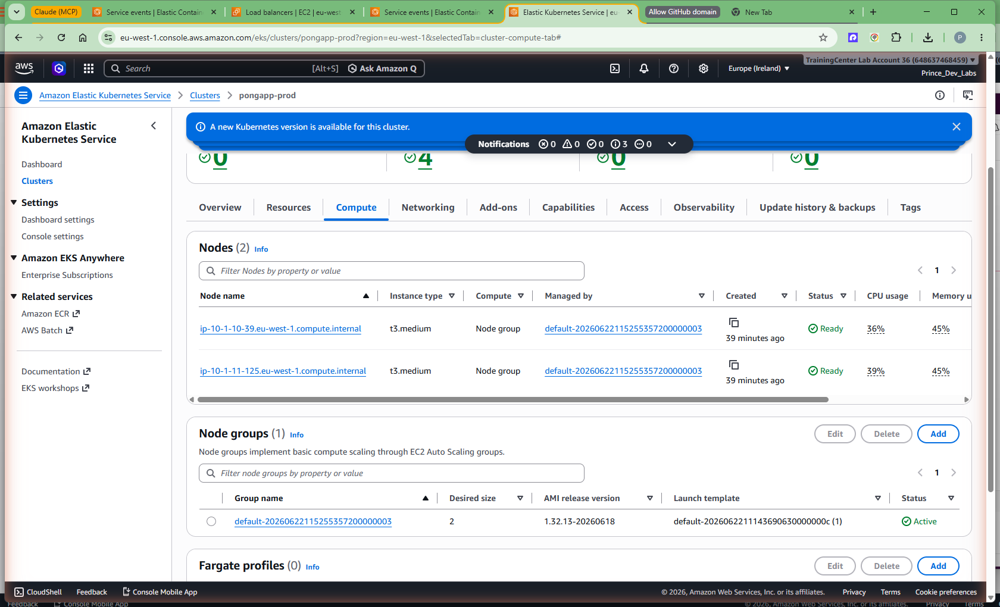
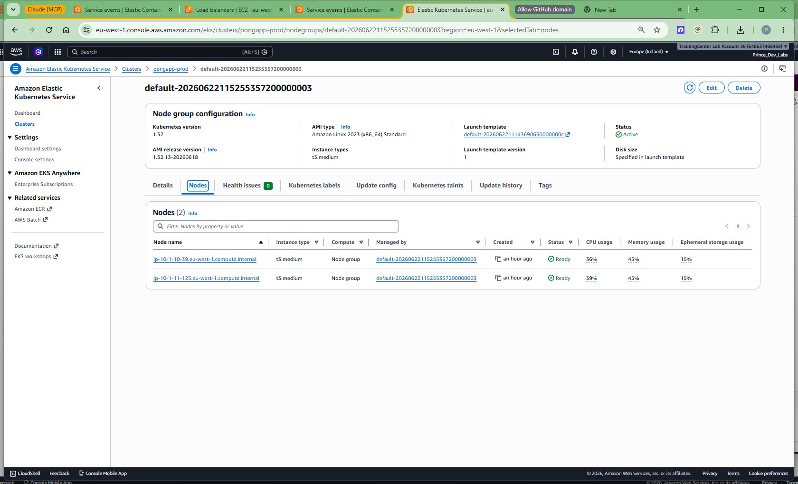
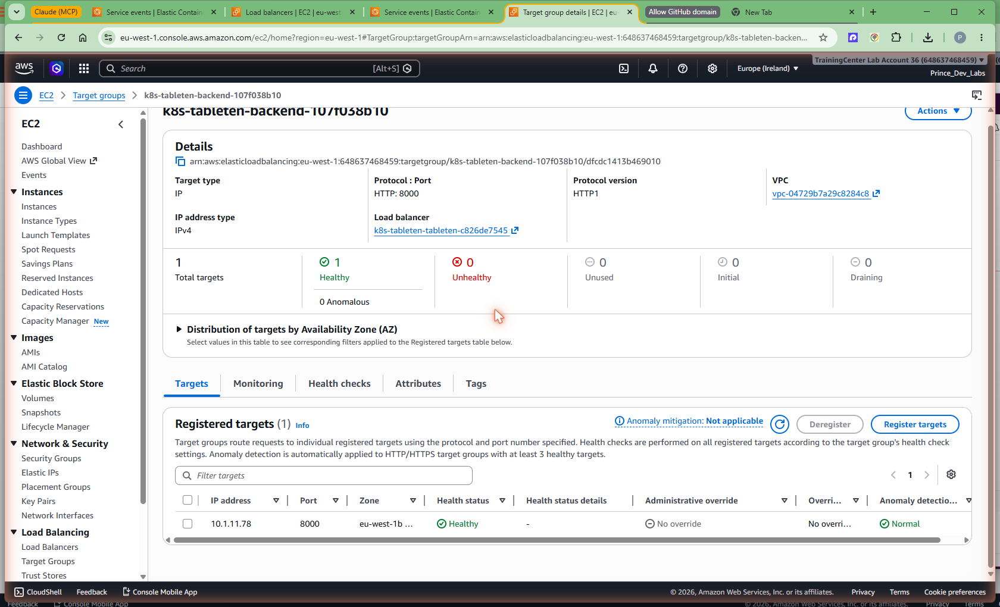

# Phase 4 — EKS Deploy (the same app, on Kubernetes)

## Goal

Deploy the **same** pongapp 4-tier app we shipped to ECS in Phase 3 — Angular/nginx
frontend, Django/daphne backend, Postgres, Redis — but this time onto **Amazon EKS**,
so the two platforms can be compared head-to-head later. The end state mirrors ECS:
the app is live on the public internet behind an AWS Application Load Balancer, with
in-cluster service discovery wiring frontend → backend, and persistent storage on EBS.

It is live right now, served through the EKS ALB:

**http://k8s-tableten-tableten-c826de7545-1164979244.eu-west-1.elb.amazonaws.com**



One screenshot does a lot of work here. It proves the **whole** Kubernetes path is
healthy in one shot: the AWS Load Balancer Controller created an ALB from our
`Ingress`, the ALB routes `/` to the frontend `Service`, the frontend nginx pod is
serving the Angular build, and (once you log in) `/api` flows nginx → CoreDNS →
backend pod → Postgres. If any link were broken you would not see this page.

> The richest part of this chapter is **Troubleshooting** — a node group that
> refused to come up, and three first-apply app bugs. Those are the parts you can't
> get from the AWS docs, and they're the parts you'll hit yourself.

## Prerequisites

- **Phase 2/3 done.** The shared ECR repos (`pongapp-backend`, `pongapp-frontend`)
  exist and hold live images — the ECS root owns them; EKS only reads them.
- **Tools:** `terraform`, `kubectl`, `helm`, and `aws` CLI authenticated to the
  account (`648637468459`), region `eu-west-1`.
- **The gitignored secrets** that the app needs:
  `k8s/secrets/db-credentials.yaml` and `k8s/secrets/app-secrets.yaml`.
- **A free moment of cost discipline.** This phase stands up a *second* VPC + NAT
  and a 2-node cluster. Run ECS **or** EKS, not both, unless you're deliberately
  comparing — see [Cost & teardown](#cost--teardown).

## Concepts (the "why")

### Why two separate Terraform roots, not one

The benchmark is only fair if ECS and EKS can each be brought up, measured, and torn
down **independently**. So the infra is split into two roots:

| Root | Owns | VPC CIDR | State key |
|------|------|----------|-----------|
| `infra/terraform/envs/prod-ecs` | Full ECS stack **+ shared singletons**: the ECR repos and the GitHub OIDC provider/roles | `10.0.0.0/16` | `pongapp/ecs/prod/terraform.tfstate` |
| `infra/terraform/envs/prod-eks` | This phase: its own VPC, the EKS cluster, IRSA roles, EBS CSI addon | `10.1.0.0/16` | `pongapp/eks/prod/terraform.tfstate` |

The reasoning, and the trade-offs:

- **No singleton collisions.** An AWS account can have exactly one GitHub OIDC
  provider and one ECR repo per name. Putting them in *both* roots would make the
  second `apply` fight the first. The ECS root **creates** them; the EKS root reads
  the ECR repos **read-only** via `data "aws_ecr_repository"`, so it never tries to
  manage — or destroy — something it doesn't own.
- **Independent lifecycle / blast radius.** `terraform destroy` on EKS can't
  accidentally take down the ECS stack, and vice-versa. Separate state files, separate
  plans.
- **Its own VPC (10.1.0.0/16).** EKS gets a brand-new VPC rather than sharing the
  ECS one (10.0.0.0/16). The two roots never peer, so a distinct CIDR keeps route
  tables and diagrams unambiguous, and means subnet/EKS discovery tags can't bleed
  across platforms. Trade-off: a second NAT gateway to pay for — acceptable for a
  run-one-at-a-time benchmark.

### Why a managed module, but wrapped in our own

The cluster uses the community `terraform-aws-modules/eks/aws ~> 21.0` module,
wrapped in a thin local `modules/eks-cluster`. We don't hand-roll the control plane,
node IAM role, OIDC provider, and access entries — the registry module encodes the
current best practice for all of that, and v21 is the line that supports the AWS
provider `~> 6.0` this project pins. The local wrapper exists so the env root only
passes a handful of inputs (cluster name, version, subnets, node sizing) and gets
clean outputs back — it keeps the "what" in the root and the "how" in the module.

The control plane is **K8s 1.32**, with **both** public and private API endpoints
(public so CI/laptop `kubectl` works; private for in-VPC traffic), **IRSA enabled**,
**KMS encryption of Kubernetes secrets**, and **CloudWatch control-plane logs**. One
managed node group: **2× t3.medium on AL2023**.

### Why the EBS CSI driver is a *standalone* addon (the cycle)

This is the single best Terraform teaching point in the phase. Three of the core
addons — **vpc-cni, kube-proxy, coredns** — are declared *inside* the EKS module's
`addons` block. The **aws-ebs-csi-driver** is deliberately **not**; it's a separate
`aws_eks_addon` resource in the env root.

Why? The EBS CSI driver needs an **IRSA role** so its controller can call the EC2
API to create/attach volumes. That role's trust policy must reference **this
cluster's** OIDC provider — which only exists *after* the cluster is created. If we
fed that role back into the module's addon block, we'd create a dependency cycle:

```
eks module ──needs──▶ IRSA role ──needs──▶ eks module's OIDC provider
   ▲                                                    │
   └──────────────────── cycle ─────────────────────────┘
```

Terraform refuses to plan a cycle. Breaking the EBS addon out into a top-level
resource lets the dependency flow one way: cluster → OIDC provider → IRSA role →
EBS addon. (vpc-cni/kube-proxy/coredns don't need IRSA, so they stay in the module
with no cycle.)

### Why an `Ingress` + ALB Controller, and how it maps to ECS

On ECS we built the ALB and target groups by hand in Terraform. On EKS we let the
**AWS Load Balancer Controller** do it: you declare a Kubernetes `Ingress` with
`ingressClassName: alb`, and the controller reconciles a real ALB, listeners, and
target groups to match. Same outcome (a public ALB in front of two services),
different control surface — declarative Kubernetes object vs declarative Terraform.
The controller authenticates to AWS via its **own IRSA role** (the one Terraform
hands us as `aws_lb_controller_role_arn`).

### Where ECS and EKS deliberately diverge: the data tier

This is a chosen benchmark dimension, not an oversight. On **ECS** the data tier is
**managed**: Postgres on RDS, Redis on ElastiCache. On **EKS** we run them
**in-cluster**: Postgres as a `StatefulSet` on an EBS PVC, Redis as a Deployment.
That lets the benchmark compare *managed vs self-hosted* state. Two consequences
worth internalizing:

- The Postgres volume uses a **`gp3-retain` StorageClass** (`reclaimPolicy: Retain`),
  so deleting the app — or even the cluster — does **not** delete the database EBS
  volume. Safer, but it means a manual EBS cleanup at teardown (see below).
- The **backend runs `replicas: 1`** on EKS. Its media/static PVCs are
  **ReadWriteOnce** EBS volumes, which can only attach to one node at a time, so a
  second replica on another node couldn't mount them. The HA path is to move
  media/static off the node — S3 (the app already has a `USE_S3` switch) or EFS
  (ReadWriteMany) — and then scale out. We left it at 1 for this phase and note the
  path. ECS sidestepped this by using S3-less RDS/ElastiCache for state and keeping
  the tasks stateless.

## Architecture



## Steps (the working runbook)

Everything below is the actual sequence that produced the live app. Follow it
top-to-bottom and you'll reproduce it.

### 1. Apply the EKS Terraform root

```bash
terraform -chdir=infra/terraform/envs/prod-eks init
terraform -chdir=infra/terraform/envs/prod-eks apply
```

This creates the VPC (10.1.0.0/16), the EKS control plane (1.32), the managed node
group (2× t3.medium), the three in-module addons, the two IRSA roles, and the
standalone EBS CSI addon. Grab the outputs you'll need next:

```bash
terraform -chdir=infra/terraform/envs/prod-eks output aws_lb_controller_role_arn
terraform -chdir=infra/terraform/envs/prod-eks output update_kubeconfig_command
```

### 2. Point kubectl at the cluster

```bash
aws eks update-kubeconfig --name pongapp-prod --region eu-west-1
```

`enable_cluster_creator_admin_permissions = true` means the principal that ran
`apply` is already a cluster admin via an EKS **access entry** (no `aws-auth`
configmap editing), so `kubectl` works immediately.

### 3. Install the AWS Load Balancer Controller (Helm)

The controller is **not** an EKS addon here — it's a Helm release, wired to the IRSA
role Terraform created. Pass the role ARN, cluster name, region, and VPC id:

```bash
helm repo add eks https://aws.github.io/eks-charts && helm repo update

helm upgrade --install aws-load-balancer-controller eks/aws-load-balancer-controller \
  -n kube-system \
  --set clusterName=pongapp-prod \
  --set region=eu-west-1 \
  --set vpcId="$(terraform -chdir=infra/terraform/envs/prod-eks output -raw vpc_id)" \
  --set serviceAccount.create=true \
  --set serviceAccount.name=aws-load-balancer-controller \
  --set "serviceAccount.annotations.eks\.amazonaws\.com/role-arn=$(terraform -chdir=infra/terraform/envs/prod-eks output -raw aws_lb_controller_role_arn)"
```

The `serviceAccount` annotation is the IRSA binding: it links the in-cluster service
account to the IAM role so the controller can create the ALB without static keys.

### 4. Apply the namespace + the gitignored secrets

```bash
kubectl apply -f k8s/secrets/db-credentials.yaml -f k8s/secrets/app-secrets.yaml
```

Secrets are applied out-of-band on purpose — they're never committed, so they're not
in the kustomize overlay.

### 5. Deploy the app with the EKS overlay

The EKS overlay (`benchmark/eks/`) **references** the generic `k8s/` base rather than
copying it, so the local/minikube manifests stay the single source of truth. Because
the overlay reaches **up and out** into `../../k8s/`, kustomize's default load
restrictor blocks it — and `kubectl apply -k` gives you no way to pass the flag that
relaxes it. So build and pipe instead:

```bash
kubectl kustomize --load-restrictor LoadRestrictionsNone benchmark/eks | kubectl apply -f -
```

That one flag (`LoadRestrictionsNone`) is the whole reason for the `kustomize | apply`
shape — it lets the overlay pull in base files outside its own directory. Use plain
`kubectl apply -k benchmark/eks` and it errors out on the `../../k8s/` paths.

The overlay does the EKS-specific work declaratively: repoints the dev Docker Hub
images at the ECR repos, adds the `gp3`/`gp3-retain` StorageClasses, the ALB
`Ingress`, and patches the base for EKS (PSS, health checks, storage classes, 1
backend replica — see Concepts and Troubleshooting).

### 6. Set the deploy-time values the overlay can't contain

Two values aren't known until the cluster is running, so they live **outside** the
overlay and are applied imperatively after deploy:

```bash
# (a) frontend nginx needs the CoreDNS ClusterIP to re-resolve the backend Service
CLUSTER_DNS=$(kubectl -n kube-system get svc kube-dns -o jsonpath='{.spec.clusterIP}')
kubectl -n table-tennis set env deployment/frontend BACKEND_RESOLVER=$CLUSTER_DNS

# (b) Django CSRF/CORS must trust the real ALB origin
ALB=$(kubectl -n table-tennis get ingress table-tennis-ingress \
  -o jsonpath='{.status.loadBalancer.ingress[0].hostname}')
kubectl -n table-tennis patch configmap env-config --type merge -p \
  "{\"data\":{\"CORS_ALLOWED_ORIGINS\":\"http://$ALB\",\"DJANGO_CSRF_TRUSTED_ORIGINS\":\"http://$ALB\"}}"

# roll both so they pick up the new values
kubectl -n table-tennis rollout restart deployment/frontend deployment/backend
```

> **Important caveat — these get reverted by every `kubectl apply -k`.** The overlay
> ships `BACKEND_RESOLVER=__CLUSTER_DNS__` (a placeholder) and the base `env-config`
> without the ALB origins. So **any** re-apply of the overlay stomps these back to
> placeholders. Re-run step 6 after every overlay change, or you'll get a frontend
> CrashLoop (bad resolver) or Django CSRF/CORS rejections. This is the same class of
> "concrete origins required" issue we hit on ECS in Phase 3 — Kubernetes just makes
> the re-apply footgun more visible.

### 7. Verify

```bash
kubectl get nodes
kubectl get pods,ingress -n table-tennis
kubectl get sc
aws eks list-addons --cluster-name pongapp-prod
ALB=$(kubectl -n table-tennis get ingress table-tennis-ingress \
  -o jsonpath='{.status.loadBalancer.ingress[0].hostname}')
curl -s -o /dev/null -w "root HTTP %{http_code}\n" "http://$ALB/"
curl -s -o /dev/null -w "api/health HTTP %{http_code}\n" "http://$ALB/api/health/"
```

## Verification — the evidence

One terminal capture proves the entire phase: **2 nodes Ready** (v1.32 / AL2023),
**all pods Running** (backend, frontend, postgres, redis), the **Ingress ADDRESS**
resolved to a real ALB hostname, the **StorageClasses** (`gp3` default + `gp3-retain`
alongside the addon's `gp2`), the **four EKS addons** (coredns, kube-proxy, vpc-cni,
plus the standalone aws-ebs-csi-driver), and **curl `/` and `/api/health/` both
returning HTTP 200** through the ALB:



Reading it against the ECS Phase 3 verification, the two platforms now answer the
same two probes (`/` 200, `/api/health/` 200) on their own ALBs — exactly the parity
the benchmark needs.

The AWS console corroborates the same state. The cluster is `Active` on Kubernetes
1.32 with zero cluster/node health issues, the managed node group runs 2× t3.medium
(Amazon Linux 2023) both `Ready`, and the backend ALB target group reports its target
healthy on the `/api/health/` check:







## Troubleshooting (the gold)

### Failure 1 — Node group `CREATE_FAILED`: "cni plugin not initialized"

**Symptom.** The very first `apply` ran for ~20 minutes and then failed: the managed
node group hit `NodeCreationFailure` with **unhealthy nodes**, the kubelet reporting
`network plugin is not ready: cni plugin not initialized`. The EBS CSI addon went
**DEGRADED** as collateral (nothing to schedule on).

**Root cause — an ordering deadlock.** By default the **vpc-cni** and **kube-proxy**
addons install *after* the node group exists. But a node can't reach **Ready**
without a CNI, and the node group waits for its nodes to be Ready before it succeeds.
So: node group waits for Ready nodes → nodes wait for CNI → CNI waits for the node
group. Deadlock; after the timeout the node group fails.

**Fix.** Tell the addons to install **before** compute, so the CNI is present the
moment the first node boots:

```hcl
# infra/terraform/modules/eks-cluster/main.tf
addons = {
  vpc-cni    = { before_compute = true, most_recent = true }
  kube-proxy = { before_compute = true, most_recent = true }
  coredns    = { most_recent = true }   # stays AFTER compute — it needs Ready nodes
}
```

`coredns` intentionally does **not** get `before_compute` — it runs as pods that need
schedulable (Ready) nodes, so it must come after. The asymmetry is the lesson:
**node-level networking (CNI, kube-proxy) before compute; pod-level services
(coredns) after.**

Recovering an already-failed node group needed a targeted replace rather than a fresh
apply:

```bash
terraform -chdir=infra/terraform/envs/prod-eks apply \
  -replace='module.eks_cluster.module.eks.module.eks_managed_node_group["default"].aws_eks_node_group.this[0]'
```

After that, nodes came up Ready and **all four addons reported ACTIVE**.

### Failure 2 — Three app bugs on the first `kubectl apply`

The cluster was healthy, but the app didn't come up clean the first time. Three
distinct issues, all visible in `kubectl get pods` / target health:

**(a) PodSecurity rejects the frontend.** The `table-tennis` namespace enforces the
**`restricted`** Pod Security Standard. The official nginx frontend runs as **root**
on **port 80**, which `restricted` forbids, so the frontend pods were rejected
outright. Fix: an overlay patch (`patch-namespace-pss.yaml`) relaxes the namespace's
`enforce` level from `restricted` → **`baseline`**. This is deliberate **parity with
ECS**, which had no Pod Security at all — we relax to baseline rather than rewrite the
upstream nginx image, keeping the two platforms comparable. (Hardening the image to
run rootless on a high port is the "do it properly" follow-up.)

**(b) Frontend `CrashLoopBackOff`: literal placeholder resolver.** The frontend
crashed because nginx's `${BACKEND_RESOLVER}` had resolved to the *literal string*
`__CLUSTER_DNS__` — the overlay's placeholder — which isn't a valid DNS server, so
nginx failed to start. Fix: set `BACKEND_RESOLVER` to the real **CoreDNS ClusterIP**
at deploy time (step 6a). This is the EKS twin of the Phase 3 nginx-resolver fix: on
ECS the resolver was the VPC DNS `169.254.169.253`; on EKS it's the CoreDNS ClusterIP.
Same mechanism (runtime re-resolution via a variable `proxy_pass`), different DNS
server.

**(c) Backend ALB target unhealthy: health check on `/`.** The `Ingress` sets a
**global** ALB health-check path of `/`, but Django answers `/` with **404** (it only
serves `/api` and `/admin`). So the backend target group went unhealthy and the ALB
stopped routing to it. Fix: a **per-Service** health-check annotation pointing the
backend's target group at the real endpoint —

```yaml
# benchmark/eks/patch-backend-svc-healthcheck.yaml (applied to Service "backend")
annotations:
  alb.ingress.kubernetes.io/healthcheck-path: /api/health/
  alb.ingress.kubernetes.io/success-codes: "200"
```

The teaching point: the **AWS Load Balancer Controller honors health-check
annotations placed on the Service** that backs a target group, which lets you give
each backend its own check. The frontend keeps the Ingress default `/` (Angular's
index returns 200), and only the backend overrides it. Once all three were fixed, the
pods went Running, both target groups went healthy, and the login page rendered.

## Cost & teardown

**While running**, this phase bills for the EKS **control plane** (~$0.10/hr), the
**NAT gateway**, and the **2× t3.medium** nodes — roughly on the order of the ECS
stack's daily run, and **on top of it if you leave both up**. Don't. Run one platform
at a time unless you're actively comparing.

Tear down in reverse order:

```bash
# 1. the app
kubectl delete -k benchmark/eks   # or: kubectl kustomize --load-restrictor LoadRestrictionsNone benchmark/eks | kubectl delete -f -

# 2. the ALB controller (so it cleans up the ALB it created)
helm uninstall aws-load-balancer-controller -n kube-system

# 3. the cluster + VPC + IRSA + EBS addon
terraform -chdir=infra/terraform/envs/prod-eks destroy
```

> **Manual EBS cleanup required.** Because Postgres uses the **`gp3-retain`**
> StorageClass (`reclaimPolicy: Retain`), its EBS volume **survives** the delete and
> the destroy — by design, so you never lose the database by accident. After teardown,
> find and delete it yourself or it bills forever:
>
> ```bash
> aws ec2 describe-volumes --region eu-west-1 \
>   --filters Name=tag:kubernetes.io/created-for/pvc/name,Values=postgres-storage-postgres-0 \
>   --query 'Volumes[].VolumeId' --output text
> aws ec2 delete-volume --region eu-west-1 --volume-id <vol-id>
> ```

## Key takeaways

- **Split the IaC by platform** (separate roots, separate VPCs/state) so ECS and EKS
  have independent lifecycles and the account's singletons — ECR, OIDC — live in
  exactly one place.
- **Order matters for EKS addons:** `before_compute = true` on **vpc-cni** and
  **kube-proxy** (nodes need CNI to go Ready); **coredns** after compute (it needs
  Ready nodes). Get this wrong and the node group dead-locks itself into
  `CREATE_FAILED`.
- **Break the EBS CSI addon out of the module** to avoid the
  cluster → IRSA → cluster dependency cycle; wire it via IRSA as a standalone
  `aws_eks_addon`.
- **The ALB Controller turns an `Ingress` into a real ALB**, and **per-Service
  health-check annotations** let each backend define its own check — point Django's
  at `/api/health/`, not `/`.
- **Some values can't live in the overlay** (CoreDNS ClusterIP, the ALB origin); set
  them at deploy time and remember **`kubectl apply -k` reverts them** every time.
- **Managed vs self-hosted state is the headline ECS↔EKS difference here**: ECS used
  RDS/ElastiCache; EKS runs Postgres/Redis in-cluster on EBS, which forces
  `replicas: 1` for the backend (RWO volumes) and a Retain'd DB volume you must clean
  up by hand. S3/EFS is the path to a multi-replica HA backend.

---

*Next:* with EKS live, **Phase 5** can finally do its Kubernetes half —
`kubectl delete pod` and watch the ReplicaSet reconcile — and compare it to ECS
desired-count reconciliation. See [05-resiliency.md](05-resiliency.md).
