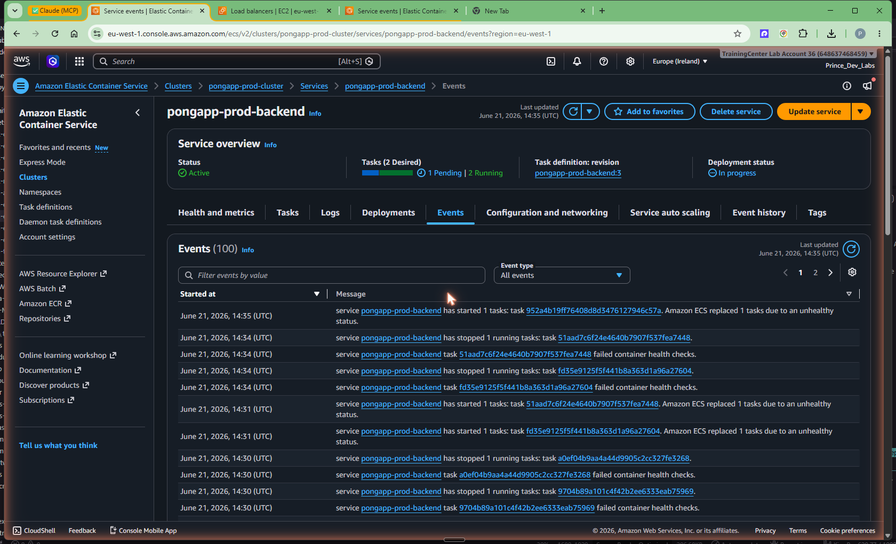
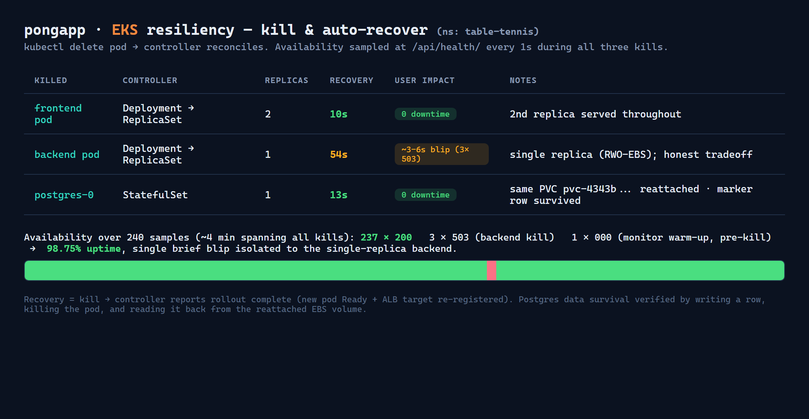

# Phase 5 — Resiliency: prove the app self-heals (ECS + EKS)

## Goal

Satisfy the brief's requirement: **manually kill a running container/task and show
the application recovers automatically** — and do it on **both** orchestrators so the
benchmark can compare them fairly. On ECS that means killing a Fargate task and
watching the service reconcile back to its desired count. On EKS it means
`kubectl delete pod` and watching the ReplicaSet / StatefulSet controller create a
replacement. In both cases we run a 1-second availability monitor against the live
ALB throughout, so we measure not just *that* it recovered but whether **users**
noticed. (EKS was unblocked by Phase 4 shipping the app to Kubernetes — see
[04-eks-deploy.md](04-eks-deploy.md).)

## Prerequisites

- The ECS stack from Phases 2–3 is deployed and healthy.
- The EKS stack from Phase 4 is deployed and healthy (cluster `pongapp-prod`,
  namespace `table-tennis`, `eu-west-1`).
- ECS backend service `pongapp-prod-backend` at desired count **2**.
- The live ALB URLs:
  - ECS: `http://pongapp-prod-alb-734452423.eu-west-1.elb.amazonaws.com`
  - EKS: `http://k8s-tableten-tableten-c826de7545-1164979244.eu-west-1.elb.amazonaws.com`

---

# Part A — ECS (Fargate)

## Concepts (the "why")

ECS services are **declarative**: you tell ECS "I want 2 backend tasks," and the
service scheduler continuously reconciles reality toward that. Kill a task and ECS
notices the gap and launches a replacement — no human, no script.

The interesting question is whether *users* notice. Two things keep the app up
during the gap:

1. **Two tasks, not one.** With desired count 2, killing one leaves a healthy
   sibling still serving.
2. **The frontend re-resolves the backend.** nginx looks up `backend.pongapp.local`
   through the VPC resolver every 10s (the fix from Phase 3). When a backend task
   dies, Cloud Map drops its IP and nginx stops sending traffic there — instead of
   caching the dead IP and returning 502s. This is exactly why that fix mattered.

## Steps

A small harness (`scratchpad/resiliency-ecs.sh`) does three things at once: polls
`/api/health/` through the ALB every second, kills one backend task, and times how
long ECS takes to get back to 2 running.

```bash
# pick a victim task
VICTIM=$(aws ecs list-tasks --cluster pongapp-prod-cluster \
  --service-name pongapp-prod-backend --query 'taskArns[0]' --output text)

# (availability monitor runs in the background hitting /api/health/ every 1s)

# kill it
aws ecs stop-task --cluster pongapp-prod-cluster --task "$VICTIM" \
  --reason "Phase 5 resiliency demo"
```

## Verification — the result

```
Killed backend task at 14:25:10
Availability during kill + recovery:  90/90 health checks = HTTP 200   (0 non-200)
ECS recovered to 2 running tasks in 140s (replacement launched, victim gone)
```

**Zero downtime.** Every one of the 90 one-second health probes through the ALB
returned 200 while ECS killed and replaced the task. The service scheduler launched
a fresh Fargate task automatically and the surviving task carried the load.

The service **Events** tab tells the same story from ECS's side — *"Amazon ECS
replaced 1 task due to an unhealthy status"* / *"has started 1 task"*:



## Troubleshooting — a real bug this demo surfaced

Watching the events, backend tasks were being replaced **continuously** (every few
minutes), not just the one I killed — each with *"failed container health checks"*.

**Root cause:** the backend container health check probed with `wget`, but the
backend image is `python:3.12-slim`, which **does not ship wget** (only the
frontend's `nginx:alpine` does). So the health-check command failed on *every*
backend task regardless of whether daphne was actually healthy — ECS dutifully
killed and replaced "unhealthy" tasks forever. The app still served (daphne was
fine, and there was always ≥1 task plus the resolver), which is why it showed as
zero-downtime churn rather than an outage.

**Fix:** probe with Python's standard library, which is guaranteed present in the
image (`infra/terraform/envs/prod-ecs/main.tf`):

```hcl
health_check_command = ["CMD-SHELL",
  "python -c \"import urllib.request; urllib.request.urlopen('http://127.0.0.1:8000/api/health/', timeout=4)\" || exit 1"]
```

After `terraform apply` + `aws ecs update-service` (task definition `:4`), backend
tasks pass their health checks and stay running — the flapping stops. Lesson:
**a container health check must use a tool that actually exists in that image.**

---

# Part B — EKS (Kubernetes)

## Concepts (the "why")

Kubernetes uses the **same control-loop idea as ECS, just different machinery.**
Instead of a service scheduler chasing a *desired count*, a **controller** chases a
declared spec:

- A **Deployment** owns a **ReplicaSet**, and the ReplicaSet's whole job is "keep N
  pods matching this template alive." Delete a pod and the ReplicaSet sees N-1 and
  creates a replacement immediately.
- A **StatefulSet** does the same, but with two guarantees a ReplicaSet can't make:
  a **stable identity** (`postgres-0` comes back as `postgres-0`, not a random name)
  and a **stable volume** (the same PersistentVolumeClaim re-attaches to the new
  pod). That's exactly what a database needs.

So the resiliency mechanism is identical in spirit to ECS — a controller reconciles
reality toward the spec — but Kubernetes gives us a richer vocabulary (ReplicaSet
vs StatefulSet) for *stateless* vs *stateful* workloads.

The honest caveat we deliberately surface here: on EKS the **backend runs a single
replica**. Its media/static volumes are **ReadWriteOnce EBS** PVCs, and an RWO
volume can only attach to one node at a time, so it can't be multi-attached across a
2-replica Deployment spread over two nodes (documented in
[04-eks-deploy.md](04-eks-deploy.md)). That single replica is the one place we expect
a user-visible blip — and we measure exactly how big it is rather than hiding it.

## Steps

Same shape as the ECS harness: start a 1-second `curl http://<eks-alb>/api/health/`
availability monitor, then perform three kills back-to-back, timing each recovery
with `kubectl rollout status`. The monitor ran continuously across all three kills
(240 samples total).

```bash
NS=table-tennis

# 1. Frontend pod (Deployment, replicas 2)
kubectl delete pod frontend-6fdbdf4ccb-bs7ms -n $NS
kubectl rollout status deploy/frontend -n $NS        # time to 2/2 Ready

# 2. Backend pod (Deployment, replicas 1 — single RWO-EBS replica)
kubectl delete pod -l app=backend -n $NS
kubectl rollout status deploy/backend -n $NS

# 3. postgres-0 (StatefulSet, replicas 1 — stateful self-heal)
kubectl delete pod postgres-0 -n $NS
kubectl rollout status statefulset/postgres -n $NS
```

For the Postgres kill we also proved **data survival**: write a marker row before
the kill, then read it back after the pod returns.

```bash
# before the kill — write a marker
kubectl exec -n $NS postgres-0 -- psql -U pongapp -c \
  "CREATE TABLE IF NOT EXISTS resiliency_marker(id serial, note text);
   INSERT INTO resiliency_marker(note) VALUES('written before kill');"

# after postgres-0 is Ready again — read it back
kubectl exec -n $NS postgres-0 -- psql -U pongapp -c \
  "SELECT note FROM resiliency_marker;"   # -> 'written before kill'
```

## Verification — the result



| Killed | Controller | Replicas | Recovery | User impact | Notes |
|--------|-----------|----------|----------|-------------|-------|
| **frontend pod** | Deployment → ReplicaSet | 2 | **10s** | **0 downtime** | 2nd replica served throughout; ALB always had a healthy frontend target |
| **backend pod** | Deployment → ReplicaSet | 1 | **54s** | **~3–6s blip** (3× HTTP 503) | single replica (RWO-EBS) — honest tradeoff, see below |
| **postgres-0** | StatefulSet | 1 | **13s** | **0 downtime** | same PVC `data-postgres-0` (`pvc-434b3b22…`, gp3-retain) reattached; marker row read back intact |

**Availability across all 240 one-second samples:** `237× 200`, `3× 503`, `1× 000`.

- The `3× 503` all landed in the **backend kill** window: for ~3–6 seconds the ALB
  had no healthy backend target while the old pod terminated and the new single pod
  registered. This is the expected single-replica gap, not an orchestrator failure.
- The `1× 000` was a **monitor warm-up timeout 43 seconds *before* any kill** — a
  client-side connect timeout on the very first probes, not a real outage.

Net: **~98.75% uptime**, with the only genuine blip isolated to the
single-replica backend. The multi-replica frontend and the StatefulSet Postgres
both recovered with **zero user-visible impact**, and Postgres came back with its
identity and data intact.

## Troubleshooting — the single-replica backend is the real lesson

The backend's brief 503 isn't a bug to fix in this phase — it's the **data-tier HA
limitation** showing through. Because the backend's static/media PVCs are
ReadWriteOnce EBS, we can only run one backend pod, so killing it means zero healthy
backend targets for a few seconds.

Two ways to get true zero-downtime on the backend, both already designed into the
app:

1. **S3 for media/static** — the app has a `USE_S3` switch. With object storage the
   backend keeps no node-local volume, so it can scale to ≥2 replicas across nodes
   and survive a pod kill like the frontend does.
2. **EFS (ReadWriteMany)** instead of EBS — an RWX volume *can* multi-attach across
   nodes, again unblocking ≥2 backend replicas.

We call this out explicitly because it's the same benchmark dimension as Phase 4's
storage discussion: **EBS RWO is cheap and simple but pins you to one replica;
S3/EFS costs a little more but buys horizontal HA.**

---

# Side-by-side — ECS ↔ EKS resiliency

This is the comparison the Phase 6 benchmark report will build on.

| Dimension | ECS (Fargate) | EKS (Kubernetes) |
|-----------|---------------|------------------|
| **Recovery mechanism** | Service scheduler reconciles **desired count** — launches a replacement *task* | ReplicaSet / StatefulSet controller reconciles **spec** — creates a replacement *pod* |
| **Vocabulary** | service + task + desired count | Deployment/StatefulSet + ReplicaSet + pod |
| **Stateless recovery** | killed backend task replaced, **0/90 failed** (zero downtime, 2 tasks) | killed frontend pod replaced in **10s**, **zero downtime** (2 replicas) |
| **Single-replica behaviour** | n/a (ran backend at 2) | backend at 1 → **~3–6s, 3× 503** during the gap (honest blip) |
| **Stateful tier** | **offloaded to RDS** (managed, Multi-AZ option) — not exercised by a kill | **self-hosted StatefulSet**: killed `postgres-0`, **same PVC reattached**, data verified, recovered in **13s** |
| **What "kill" looks like** | `aws ecs stop-task` | `kubectl delete pod` |
| **How you time recovery** | poll `describe-services` runningCount → desired | `kubectl rollout status` |

**The big-picture takeaway:** the *self-healing concept is identical* — both are
declarative control loops — so neither orchestrator "wins" on the basic recovery
requirement. The real difference is **where the stateful tier lives**:

- On **ECS** we leaned on **managed RDS**, so database resilience is AWS's problem
  (Multi-AZ failover) and there's nothing to kill — less to operate, but a managed
  service bill and less control.
- On **EKS** we ran **Postgres ourselves** as a StatefulSet and *proved* it
  self-heals with its data intact — more control and no RDS bill, but the HA story
  (and the single-replica backend blip) is now **our** responsibility.

That managed-vs-self-hosted distinction is the same axis Phase 4 raised, and it's
the most decision-relevant input into the Phase 6 CTO recommendation.

## Cost & teardown

This phase adds **no new resources** — it only kills and lets existing
tasks/pods recover. But the **EKS cluster is still running** (control plane + NAT
gateway + 2 worker nodes), and the ECS stack too, each billing ~$2.50–3/day. They
run independently — don't leave both up.

```bash
# ECS
terraform -chdir=infra/terraform/envs/prod-ecs destroy

# EKS (helm uninstall the ALB controller first, then destroy; the Postgres EBS
# volume is Retain'd, so delete it by hand afterwards — see chapter 04)
terraform -chdir=infra/terraform/envs/prod-eks destroy
```

## Key takeaways

- **Same concept, two vocabularies.** ECS reconciles a *desired count* (replacement
  task); EKS reconciles a *spec* via the ReplicaSet/StatefulSet controller
  (replacement pod). Both self-heal automatically with no human in the loop.
- **Multi-replica = invisible recovery.** ECS backend at 2 tasks → 0/90 failed
  probes; EKS frontend at 2 replicas → 10s recovery, zero downtime.
- **Single-replica = an honest blip.** The EKS backend (single RWO-EBS replica)
  showed ~3–6s / 3× 503 during its kill. The fix is S3 (`USE_S3`) or EFS RWX so it
  can run ≥2 replicas — a data-tier limitation, not an orchestrator one.
- **Stateful self-healing works on EKS.** Killing `postgres-0` kept its identity,
  reattached the same PVC, and the data survived (verified by a marker row) —
  recovered in 13s with zero downtime.
- **The benchmark axis is managed-vs-self-hosted state.** ECS offloads the DB to
  RDS (nothing to kill, AWS owns HA); EKS self-hosts it and we proved it heals.
  This is the key input to the Phase 6 recommendation.
- Health checks are only as good as the tool they call — `wget` in a wget-less image
  silently fails every probe. Match the probe to the image.
