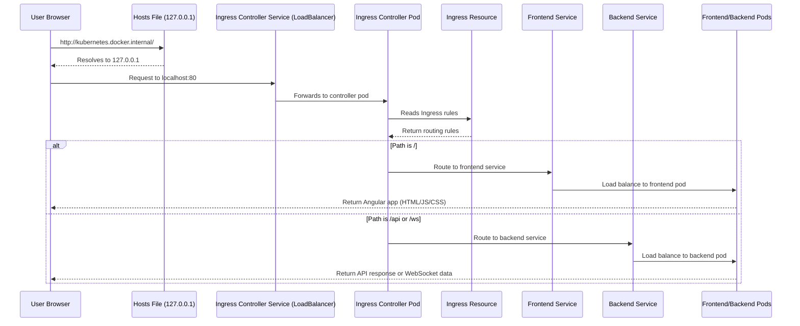

# How & Why It's Working: The Table Tennis K8s Story

## 🎬 The Story: "The Missing Traffic Cop"

### **Act 1: The Setup (What We Built)**

We deployed all our application components to Minikube (Docker Desktop Kubernetes):

```
┌─────────────────────────────────────────────────────────────┐
│           Docker Desktop Kubernetes Cluster              │
├─────────────────────────────────────────────────────────────┤
│                                                     │
│  ┌──────────┐  ┌──────────┐  ┌──────────┐       │
│  │Frontend │  │Backend  │  │PostgreSQL│       │
│  │  (2 pods)│  │ (2 pods)│  │ (1 pod) │       │
│  └──────────┘  └──────────┘  └──────────┘       │
│       │             │             │                     │
│  ┌──────────┐  ┌──────────┐                     │
│  │ Redis    │  │Ingress   │                     │
│  │ (1 pod) │  │ Resource  │                     │
│  └──────────┘  └──────────┘                     │
│                                                     │
└─────────────────────────────────────────────────────────────┘
```

**Status**: All pods Running & Ready ✅

---

### **Act 2: The Problem (Why It Didn't Work)**

We created an **Ingress Resource** (`table-tennis-ingress`) that said:

```yaml
spec:
  rules:
    - host: kubernetes.docker.internal
      http:
        paths:
          - path: / → frontend service
          - path: /api → backend service
          - path: /ws → backend service (WebSocket)
```

**But nothing happened when we visited `http://kubernetes.docker.internal`!**

**Why?** 

Think of it like this:

```
┌────────────────┐     ┌────────────────┐
│ Ingress     │     │ Ingress     │
│ Resource    │  =  │ Recipe      │ (just instructions)
│ (ConfigMap)  │     │ (paper)    │
└────────────────┘     └────────────────┘

┌────────────────┐     ┌────────────────┐
│ Ingress     │  =  │ Chef        │ (reads recipes, cooks)
│ Controller  │     │ (person)    │
└────────────────┘     └────────────────┘
```

**Our problem**: We had the **recipe** (Ingress Resource) but no **chef** (Ingress Controller)!

---

### **Act 3: The Solution (What We Did)**

#### **Step 1: Install the Missing Chef (Ingress Controller)**

We ran this command:

```bash
kubectl apply -f https://raw.githubusercontent.com/kubernetes/ingress-nginx/controller-v1.8.0/deploy/static/provider/cloud/deploy.yaml
```

**What this created:**

```
┌─────────────────────────────────────────────────────────────┐
│         ingress-nginx namespace (new)               │
├─────────────────────────────────────────────────────────────┤
│                                                     │
│  ┌──────────────────────────────────────┐        │
│  │ ingress-nginx-controller (Deployment)  │        │
│  │  - Runs as pods in this namespace    │        │
│  │  - Watches for Ingress resources       │        │
│  │  - Reads rules and configures nginx     │        │
│  └──────────────────────────────────────┘        │
│                                                     │
│  ┌──────────────────────────────────────┐        │
│  │ ingress-nginx-controller (Service)     │        │
│  │  - Type: LoadBalancer                │        │
│  │  - Exposes port 80 on localhost        │        │
│  └──────────────────────────────────────┘        │
│                                                     │
└─────────────────────────────────────────────────────────────┘
```

#### **Step 2: Wait for Controller to Start**

```bash
kubectl get pods -n ingress-nginx
# WAIT FOR: ingress-nginx-controller-xxx  Running
```

**Why it took time**: The controller image had to be pulled (downloaded) from the registry.

---

### **Act 4: Why It Works Now (The Traffic Flow)**

Here's what happens when you visit `http://kubernetes.docker.internal`:

```
┌──────────┐
│ Browser  │
│          │
└────┬─────┘
     │
     │ 1. DNS Resolution
     ▼
┌─────────────────────────────────────────────────────────────┐
│ Docker Desktop Magic:                                │
│  - Automatically adds to Windows hosts file:         │
│    127.0.0.1  kubernetes.docker.internal      │
└─────────────────────────────────────────────────────────────┘
     │
     │ 2. Request goes to 127.0.0.1:80
     ▼
┌─────────────────────────────────────────────────────────────┐
│ Ingress Controller Service (LoadBalancer)              │
│  - Listens on localhost:80 (external IP)            │
│  - Forwards to ingress-nginx-controller pod          │
└─────────────────────────────────────────────────────────────┘
     │
     │ 3. Controller reads Ingress Resource
     ▼
┌─────────────────────────────────────────────────────────────┐
│ Ingress Resource (table-tennis-ingress)               │
│  Rules:                                              │
│  - host: kubernetes.docker.internal              │
│  - / → frontend service                             │
│  - /api → backend service                            │
│  - /ws → backend service (WebSocket)             │
└─────────────────────────────────────────────────────────────┘
     │
     │ 4. Route traffic based on path
     ▼
     ├───────────────→ / → Frontend Service → Frontend Pods
     │                  (Angular app served by nginx)
     │
     └───────────────→ /api, /ws → Backend Service → Backend Pods
                       (Django + Daphne handles HTTP + WebSocket)
```

---

## 🔧 Technical Deep Dive

### **Component Roles**

| Component | Type | Role | Status |
|-----------|------|------|--------|
| **Ingress Resource** | Configuration | Defines routing rules (host, paths, backends) | ✅ Created in `k8s/ingress/ingress.yaml` |
| **Ingress Controller** | Pod (Deployment) | Reads Ingress resources, configures nginx, routes traffic | ✅ Installed from GitHub |
| **Ingress Class** | Cluster Resource | Tells Ingress which controller to use (`nginx`) | ✅ Created by controller install |
| **Frontend Service** | ClusterIP | Internal DNS: `frontend.table-tennis.svc.cluster.local` | ✅ Running |
| **Backend Service** | ClusterIP | Internal DNS: `backend.table-tennis.svc.cluster.local` | ✅ Running |

---

### **Why Docker Desktop Uses `kubernetes.docker.internal`**

Docker Desktop automatically configures this for you:

```
# Windows hosts file (C:\Windows\System32\drivers\etc\hosts)
127.0.0.1  kubernetes.docker.internal
```

This means:
- When you type `http://kubernetes.docker.internal` in your browser
- Your computer looks at the hosts file
- Sees `127.0.0.1` (localhost)
- Sends request to your local machine
- Docker Desktop intercepts it and sends it to the Kubernetes cluster

---

### **The Sequence (Step-by-Step)**



---

## 📋 What We Did vs. What We Could Have Done

### **Option 1: What We Did (Ingress - Production Style)**
```bash
# Install controller
kubectl apply -f https://.../ingress-nginx/deploy.yaml

# Access via
http://kubernetes.docker.internal
```
**Pros**: 
- ✅ Production-ready (used in EKS/AKS/GKE)
- ✅ Supports multiple apps on same cluster
- ✅ Path-based routing (`/`, `/api`, `/ws`)
- ✅ Host-based routing (`app1.local`, `app2.local`)

**Cons**:
- ❌ More complex (needs controller)
- ❌ Takes time to install

---

### **Option 2: Port-Forward (Quick Testing)**
```bash
kubectl port-forward -n table-tennis svc/frontend 8080:80
# Access via http://localhost:8080
```
**Pros**: 
- ✅ Simple (no controller needed)
- ✅ Works immediately

**Cons**:
- ❌ Not production-ready
- ❌ Manual (need to keep terminal open)
- ❌ One service per port-forward

---

### **Option 3: NodePort (Alternative)**
```yaml
# k8s/frontend/service.yaml
spec:
  type: NodePort
  ports:
    - port: 80
      nodePort: 30080
```
```bash
minikube ip  # Get node IP (e.g., 192.168.65.3)
# Access via http://192.168.65.3:30080
```
**Pros**: 
- ✅ Works without ingress controller
- ✅ Can access from any machine on network

**Cons**:
- ❌ Port range limited (30000-32767)
- ❌ Not as clean as Ingress

---

## 🎯 Summary: "The Chef Finally Arrived"

### **The Problem**
- We had a **recipe** (Ingress Resource) but no **chef** (Ingress Controller)
- The recipe said "send `/` to frontend, `/api` to backend"
- But nobody was reading the recipe!

### **The Solution**
- We installed the **Ingress Controller** (the chef)
- It read our Ingress Resource (the recipe)
- Now it knows how to route traffic

### **The Result**
```
http://kubernetes.docker.internal
        ↓
  Docker Desktop (hosts file → 127.0.0.1)
        ↓
  Ingress Controller Service (LoadBalancer on localhost)
        ↓
  Ingress Controller Pod (reads Ingress rules)
        ↓
  Routes based on path:
      / → Frontend Service → Frontend Pods (Angular)
      /api → Backend Service → Backend Pods (Django)
      /ws → Backend Service → Backend Pods (WebSocket)
```

---

## 📝 Files We Created

| File | Purpose | Why It Matters |
|------|---------|---------------|
| `k8s/ingress/ingress.yaml` | Ingress Resource (the recipe) | Defines how traffic flows |
| `k8s/frontend/service.yaml` | Frontend Service | Internal DNS for frontend pods |
| `k8s/backend/service.yaml` | Backend Service | Internal DNS for backend pods |
| `k8s/configmaps/env-config.yaml` | Environment variables | Tells backend how to connect to DB/Redis |

**The missing piece**: `ingress-nginx-controller` (installed from GitHub, not in our repo)

---

## 🚀 Quick Verification Commands

```bash
# Check Ingress Controller is running
kubectl get pods -n ingress-nginx 

# Check Ingress has address
kubectl get ingress -n table-tennis 
# Should show: ADDRESS: kubernetes.docker.internal

# Test in browser
http://kubernetes.docker.internal        # → Frontend (Angular)
http://kubernetes.docker.internal/api/schema/  # → Backend (Django API)
```

---

## 🎓 Why This Matters for EKS Migration

When we move to **EKS (AWS)**, the same concept applies:

| Docker Desktop | EKS (AWS) |
|---------------|-------------|
| Ingress Controller = nginx-controller | Ingress Controller = AWS Load Balancer Controller |
| Host = `kubernetes.docker.internal` | Host = `yourdomain.com` |
| Service Type = LoadBalancer (local) | Service Type = LoadBalancer (AWS ALB/NLB) |
| Hosts file magic by Docker | Route53 DNS in AWS |

**The pattern is identical** - only the controller and DNS change!

---

**End of Story** 🎬
